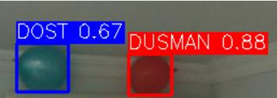
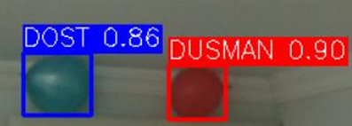
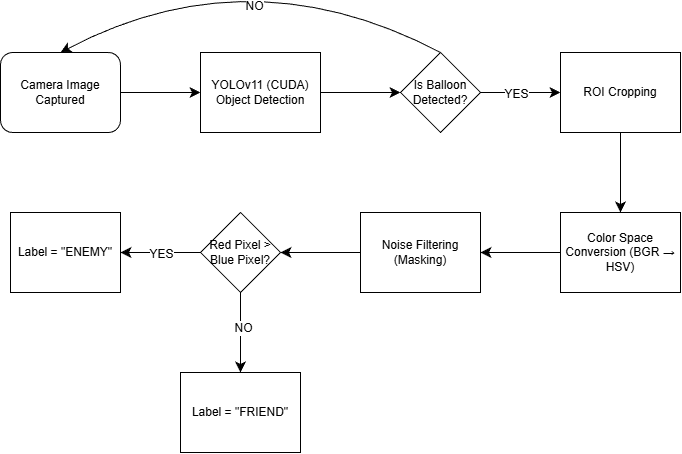
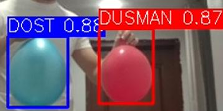
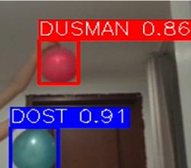
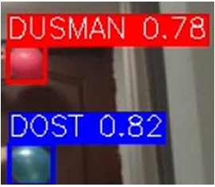

# 🚀 Autonomous Threat Neutralization System (Hybrid YOLOv11 + OpenCV)


This project is an autonomous defense system prototype designed to detect, track, and classify moving targets (balloons) in real-time. It utilizes a **Hybrid Architecture** combining Deep Learning for object detection and Computer Vision for logic-based Friend/Foe (IFF) classification.

## 🎯 Project Overview
The system is built to autonomously distinguish between **"Friendly" (Blue)** and **"Hostile" (Red)** targets within a dynamic environment, simulating a real-world defense scenario.

* **Deep Learning:** Utilizes the state-of-the-art **YOLOv11** model (trained on Google Colab T4 GPU) for high-accuracy object detection.
* **Computer Vision:** Implements **OpenCV** with HSV color space analysis to eliminate bias and ensure deterministic classification.
* **Hardware Acceleration:** Optimized for **NVIDIA CUDA** to ensure low-latency performance for tracking moving targets.

---

## 📉 Dataset Optimization (Engineering Approach)
During the initial development, a dataset of **7000 images** was tested. However, performance analysis revealed a significant **class imbalance** (too many red balloons), causing the model to be biased towards the "Hostile" class.

To solve this engineering problem, the dataset was optimized down to **1600 task-specific images**. This balanced dataset eliminated the bias and improved the detection accuracy for both classes.

| **Initial Dataset (7000 Images)** | **Optimized Dataset (1600 Images)** |
|:---------------------------------:|:-----------------------------------:|
|  |  |
| *High Bias & Class Imbalance* | *Balanced & Task-Oriented* |

---

## 🛠️ System Architecture & Workflow
The pipeline processes the camera feed through YOLOv11 to locate targets, crops the Region of Interest (ROI), and applies pixel-based voting algorithms to determine engagement.



### Core Logic
1.  **Detection:** YOLOv11 identifies the target (Confidence > 0.5).
2.  **Focus:** The system crops the bounding box (ROI).
3.  **Decision (IFF):** Pixel density analysis in HSV color space.
    * 🔴 **Red Target:** Classified as **HOSTILE** (Engage signal triggered).
    * 🔵 **Blue Target:** Classified as **FRIENDLY** (Engagement blocked).

---

## 📊 Field Test Results (Distance & Dynamics)
The system has been rigorously tested at various distances (**2m, 3m, 5m**) with moving targets. The hybrid architecture maintained high confidence scores even as the target size decreased.

### Test 1: Close Range (2 Meters)
**Result:** Immediate lock-on with high confidence (Conf > 0.88).


### Test 2: Mid Range (3 Meters)
**Result:** Stable tracking of moving targets with no frame drops.


### Test 3: Long Range (5 Meters)
**Result:** Successful classification despite smaller pixel area (Conf > 0.78).


---

## 📂 Installation & Usage

1.  **Clone the repository:**
    ```bash
    git clone [https://github.com/TahaKorkmaz0/Autonomous-Balloon-Defense-System.git](https://github.com/TahaKorkmaz0/Autonomous-Balloon-Defense-System.git)
    ```
2.  **Install dependencies:**
    ```bash
    pip install -r requirements.txt
    ```
3.  **Run the system:**
    ```bash
    python src/main.py
    ```

---

*Developed by Taha Korkmaz - Mechatronics Engineering Student*
